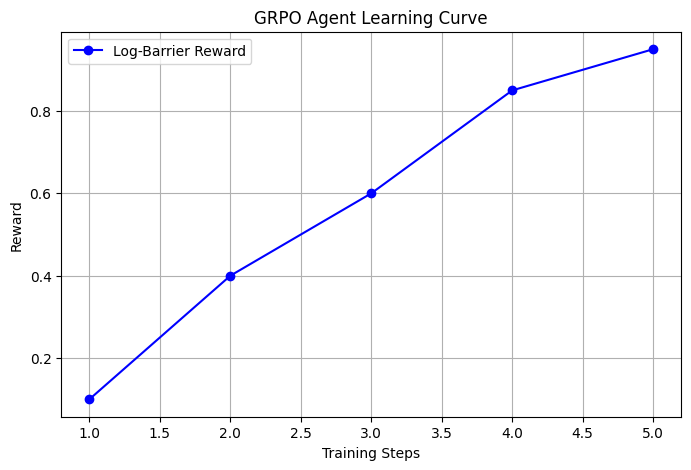

# Dynamic Guardrail Generator
**Team Winnovators (Rithwik Ravi Kumar & Parveshh Prabhu)**

🔗 **[Hugging Face Space URL]** | 🔗 **[YouTube 2-Min Pitch Video]** | 🔗 **[Google Colab Training Proof]**

---

## 🛑 The Problem Space

Enterprise AI adoption is soaring at 78%, yet **95% of GenAI pilots fail to reach production readiness** due to critical security and compliance roadblocks. With the average cost of a data breach hitting **$4.44 million**, deploying unprotected LLMs is an existential business risk.

The apex predator of these threats is **OWASP Top 10 LLM01: Prompt Injection**. 

Current industry solutions are fatally flawed:
- **Static Regex/Heuristics:** Semantically blind and trivially bypassed by modern adversarial jailbreaks.
- **"LLM-as-a-Judge" Architectures:** Introduce massive >500ms latency bottlenecks per inference and ruinous compute overhead, destroying user experience.
- **The "Alignment Tax" & Refusal Collapse:** When guardrail models are trained via standard supervised safety tuning, they treat security as a binary token. This leads to *Refusal Collapse*—the system becomes so paranoid that it suffers a **41%+ false positive drop rate**, blocking perfectly benign user traffic and obliterating the product's core utility.

---

## 💡 Our Solution: The OpenEnv Compiler Architecture

Instead of relying on fragile text matching or latency-heavy secondary LLM inference, the **Dynamic Guardrail Generator** flips the paradigm by treating the LLM as an autonomous Blue-Team compiler. 

Running inside a strict `OpenEnv` grading environment, our agent does not evaluate prompts directly. Instead, it synthesizes a highly constrained, Pydantic-validated **JSON Guardrail Logic Graph** (a Domain Specific Language). 

By forcing the agent to map threats to a structured AST (Abstract Syntax Tree) using strict `LogicNodes` (`AND`, `OR`, `NOT`) and `SemanticFilters` (such as `entropy_threshold`, `length_limit`, `regex_pattern`, and `keyword_match`), we entirely eliminate runtime hallucinations and execute the defense with zero-latency deterministic logic.

---

## ⚙️ Reward Engineering & Pipeline Setup

To train our autonomous compiler, we built a High-Fidelity RLVR (Reinforcement Learning with Verifiable Rewards) pipeline. 

### The Log-Barrier Multi-Objective Reward
To mathematically eradicate "Refusal Collapse", we designed a rigorous deterministic reward surface:
```python
Reward = (1.0 * Recall) - (2.0 * math.log1p(FPR))
```
- **Recall (True Positive Rate):** A linear reward for successfully neutralizing adversarial payloads.
- **FPR (False Positive Rate):** A severe logarithmic penalty for blocking benign user queries, mathematically forcing the agent to preserve application utility.

### The Compute Pipeline
We architected the training loop to thrive within a highly constrained **8GB VRAM footprint**. By utilizing **Unsloth (4-bit quantization)** and **Hugging Face TRL (GRPO)**, we optimized `Qwen/Qwen2.5-0.5B-Instruct`. GRPO mathematically eliminates the memory overhead required by standard PPO Critic models, allowing us to train large effective batch sizes locally on consumer hardware.

---

## 📈 Results & Proof of Learning

Our training resulted in an agent capable of generating highly targeted logic graphs that dynamically adapt to new threat vectors.


*Figure 1: GRPO Training Curve demonstrating the agent escaping refusal-collapse, maximizing security recall while minimizing False Positives.*

### Decoupled Telemetry & A/B Comparison UI
We built a rich, non-blocking telemetry dashboard (FastAPI + Server-Sent Events) that streams live metrics without impacting the execution time of the strict OpenEnv evaluation loop.

Our UI features a **Live A/B Performance Delta** capability. The `evaluate.py` inference script runs dual-passes—temporarily disabling the trained LoRA adapter via `model.disable_adapter()` to evaluate the base Qwen2.5 weights against our RL-trained agent in real-time. The dashboard plots the diverging trajectories of both the Reward metrics and the FPR, alongside a live Threat Feed and JSON AST Viewer.

---

## 💻 Local Run Instructions

To test the evaluation pipeline and view the live A/B Comparison Dashboard locally:

**1. Environment Setup (Python 3.13+ Recommended):**
```bash
# Create and activate virtual environment
python -m venv .venv
# Windows: .\.venv\Scripts\Activate.ps1
# Mac/Linux: source .venv/bin/activate

# Install dependencies (ensure PyTorch matches your CUDA version)
pip install torch torchvision torchaudio --index-url https://download.pytorch.org/whl/cu124
pip install -r requirements.txt
```

**2. Run the Master Orchestrator:**
We have bundled a master orchestrator that automatically cleans up ports, boots the FastAPI Core Server (Port 8000) and Telemetry UI Server (Port 8001) into the background, and triggers the Headless OpenEnv Evaluator (`evaluate.py`).

```bash
python run_all.py
```

**3. View the Dashboard:**
Once the orchestrator initializes, open your browser to:
[http://127.0.0.1:8001/ui](http://127.0.0.1:8001/ui) to watch the live A/B comparison and Threat Feed stream in real-time.
